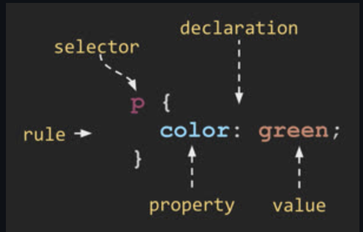
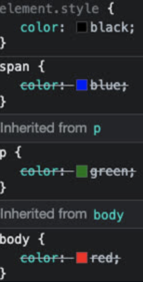
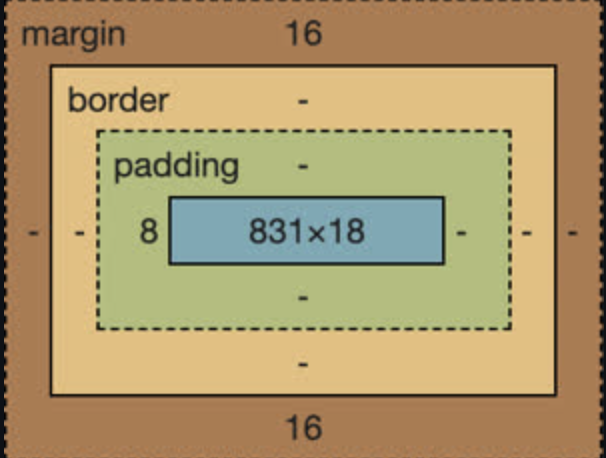
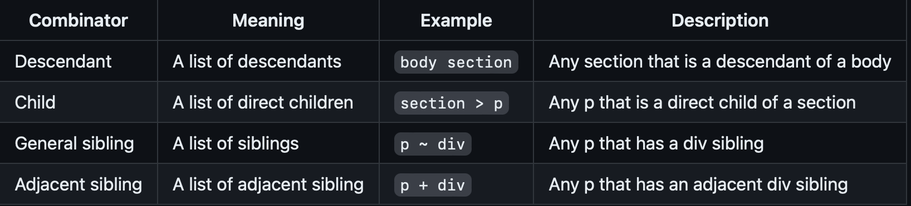
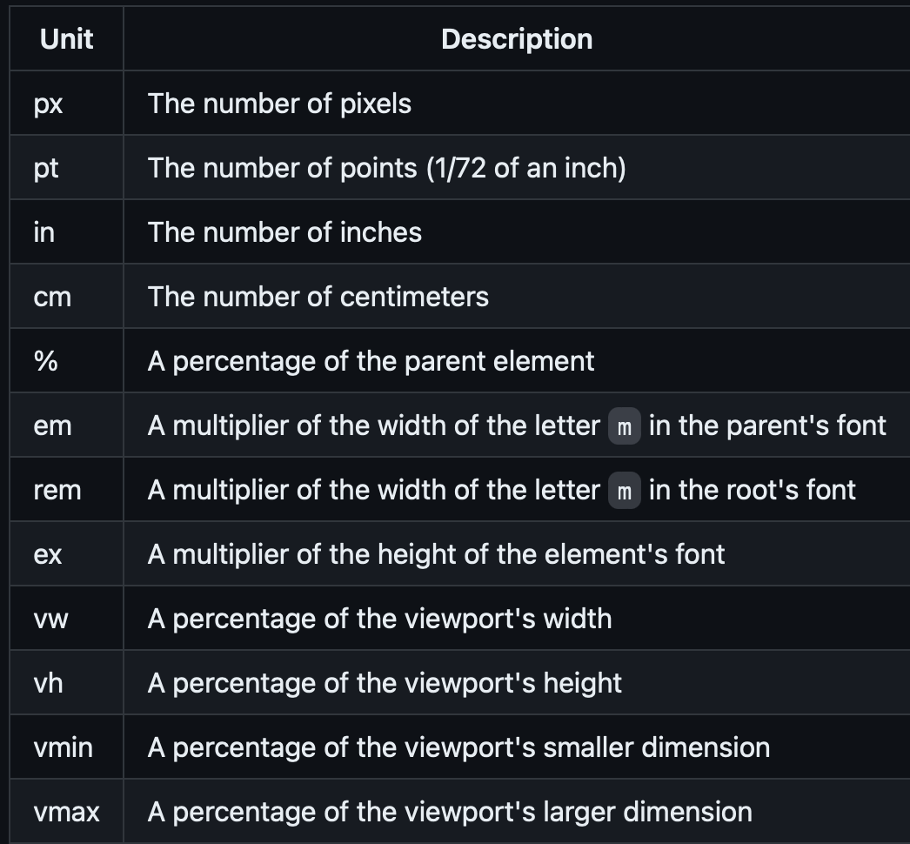
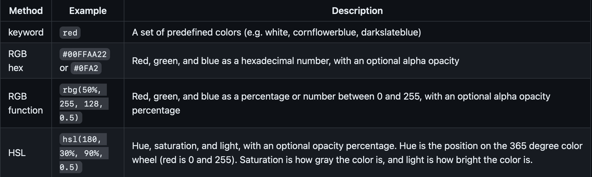
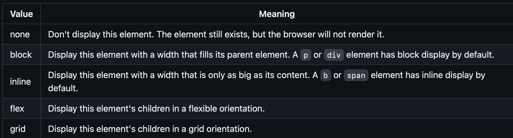

## Cascading Style Sheets

> Converts the structure and content of HTML into vibrant, responsive experiences.

CSS is primarily concerned with defining rulesets, or simply rules. A rule is comprised of a selector, declaration, property, and property value.

Rules cascade down from highest nodes in the DOM tree to the lowest. Lower levels override higher declarations. Example:

Everything is defined as a box in CSS. Here are the boxes in question:

#### Selectors

Learn more selector specifics at [MDN](https://developer.mozilla.org/en-US/docs/Web/CSS/Pseudo-classes)

- `*` - Everything in the document
- Element Type:
  - `*, body, h1, section` are all valid html tags (element types) that you can apply styles to
- Combinators:
  - 
- Class:
  - Any element can have 0 or more classifications applied to it
- ID:
  - All Ids are unique in an HTML document. Prefix with a # `#physics { styles }`
- Attribute:
  - select elements based on attributes. Select element with any attribute `a[href]`. Select with a required value for attribute `a[href="./fish.png"]`. Or use wildcards `a[href*="https://"]`
- Pseudo:
  - Select based on positional relationships, mouse interactions, link visiation states, and attributes

#### Units

- Tons of units, here's a few of the more common ones:
  

#### Color

- 4 ways of representing color:
  

#### Fonts

- 4 kinds: `serif`, `san-serif`, `fixed`, and `symbol`. san-serif don't have extra strokes. Fixed are useful for lining up text (code or tables).
- Import using either
  `@font-face { font-family: Quicksand; src: url();}`
  or
  `@import url('https://fonts.googleapis.com/css2?family=Rubik Microbe&display=swap');`

### Responsive Design!

Make stuff look good across devices!

- CSS display property determines how an element is displayed by the browser. Common options include:
  
- Use this code in the `head` to not scale page: `<meta name="viewport" content="width=device-width,initial-scale=1" />`
- Float is used to get things to wrap around something
- Media queries:
  - You can change orientation based on which side of the screen is longest
    - `@media (orientation: portrati) {}`
  - You can also make parts of the app disappear if the screen gets too narrow: - `@media (orientation: portrait) {
aside { display: none;}
}`
- Flex box!!!
