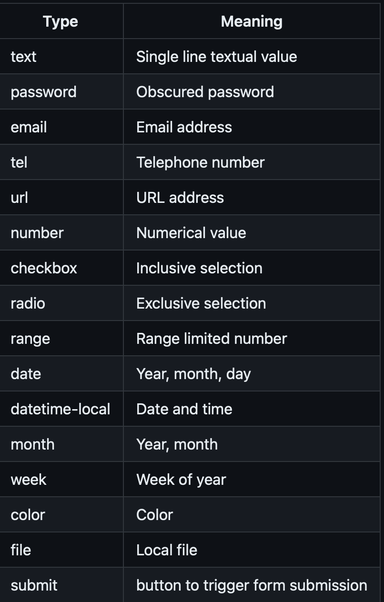

## HyperText Markup Language

HTML is used to create the structure of web applications. There are over 100 tags that define the way elements on the page interact and are rendered.

HTML is a tree. DOM

> Basic tags

- `head`: Header info
- `body`: Entire content of page
- `main`: Main content of page
- `nav`: Navigational inputs
- `header`: Header of main content
- `footer`: Footer of main content
- `section`: Section of main content
- `aside`: Aside content from main content
- `div`: Block division of content
- `span`: Inline division of content
- `b`: Bring attention
- `dialog`: Interactive component such as a confirmation
- `<!--comments--!>`: Comment out text

> Input Tags

- `form`: Input containe and submission
- `fieldset`: Labeled input grouping
- `input`: Multiple types
  
- `select`: Selection dropdown
- `optgroup`: Grouped selection dropdown
- `option`: Selection option
- `textarea`: Multiline text input
- `label`: Individual input label
- `output`: Output of input
- `meter`: Display value with a known range

When you submit a form to the server, it sends the data found in the name attribute and value!

Most input elements share common attributes, such as name, disabled (disables user's ability to interact with input), value, and required (value is required to be valid).

Good design gives feedback on valid/invalid inputs before or as user begins to input. Don't make them guess!

> Media Tags

- `img`, `audio`, and `video` tags are simple references to external files. `svg` and `canvas` tags contain code for rendering images and animations.
