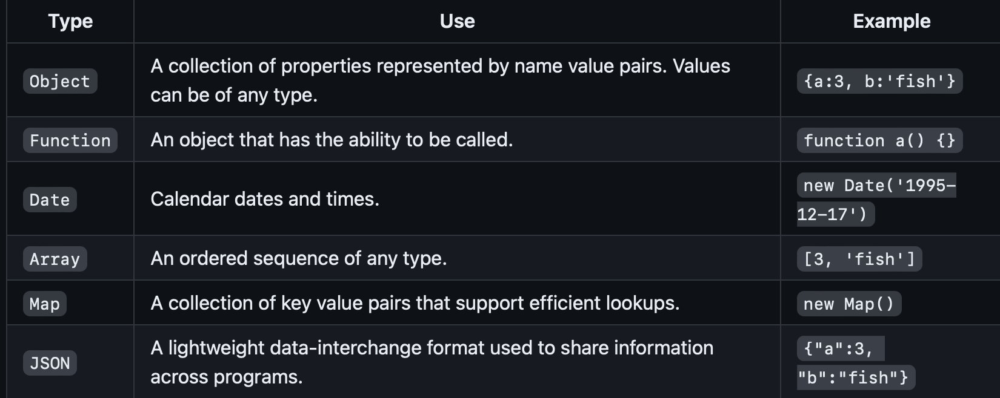

## Javascript

#### Console

The console object provides interaction with the runtime debugger console.

- Always use strict equality "==="
- Log has formatting/declarations enambed -> `console.log('%c JavaScipt Demo', color:green;);`
- Use `time` and `timeEnd` to see how long it takes for code to run:
  - `console.time
- Use `console.count('')
` to figure out

#### Variables

Declare using ...
`var x = 1` (now deprecated)
`let y = 1` Allows type changing
`const z = 'tacos'` Throws an error if you try and change type

Primitive types: Null, undefined, boolean, number, BigInt, String, Symbol (unique value)

Object Types:


Falsy values: 0, -0, '', NaN, Null, undefined

#### Conditionals

- `if`, `else`, `else if` Supported
- Can also use the turnary operator (shorthand): `a == 1 ? console.log(1) : console.log("not 1");`

#### Loops

- For
- Do while
- While
- For in (iterates over an object's property names)
  ```
  const obj = { a: 1, b: 'fish' };
  for (const name in obj) {
  console.log(name);
  }
  // OUTPUT: a
  // OUTPUT: b
  ```
  For arrays, the property name is the index (0,1...)
- For of iterates over an iterable's property values
- Break and continue supported

#### Strings

Use strings with backticks to give JS code within `${}` in a string
Common methods: length, indexOf (substring), split, startsWith, endsWith (return bool), toLowerCase

#### Functions

In JS, functions are first-class objects. This means they can be assigned a name, passed as a parameter, returned as a result, and referenced from an object or array like any other variable.

You can give functions default params.

Anonymous functions allow you to pass a function as a parameter

Creating, passing, and returning functions

```
// Anonymous declaration of the function that is later assigned to a variable
const add = function (a, b) {
return a + b;
};

    // Function that logs as a side effect of its execution
    function labeler(label, value) {
    console.log(label + '=' + value);
    }

    // Function that takes a function as a parameter and then executes the function as a side effect
    function addAndLabel(labeler, label, adder, a, b) {
    labeler(label, adder(a, b));
    }

    // Passing a function to a function
    addAndLabel(labeler, 'a+b', add, 1, 3);
    // OUTPUT: a+b=4

    // Function that returns a function
    function labelMaker(label) {
    return function (value) {
        console.log(label + '=' + value);
    };
    }

    // Assign a function from the return value of the function
    const nameLabeler = labelMaker('name');

    // Calling the returned function
    nameLabeler('value');
    // OUTPUT: name=value
```

Inner functions allow you to modularize your code (enable it to respond differently based on input type, without exposing it)

**Arrow Functions**
Cannot be used for constructors or iterator generators

**Closures**
Return the values from when they were created, not when they are executed

#### Regex

#### Strings

**Template Literals**

#### Arrays

Common operations:


#### JSON

JavaScript Object Notation is used to share and store data. Always contains a valid data type: string, number, bool, array, object, or null.

Convert from JS to JSON with the `JSON.stringify(obj)` function.
Convert from JSON to JS with the `JSON.parse(json)` function

#### Regular Expressions

Textual pattern matchers. Use to find text in a string to be replaced or simply to know it exists. You can either create a regular expression using the class constructor or by making a literal.

```
//THESE ARE EQUIVALENT
const objRegex = new RegExp('ab*', 'i');
const literalRegex = /ab*/i;
```

#### Special Operations

- Logical Or
  - Evaulates to right if left is falsey:
  - Ex. `let x = null || 5` evaluates to x = 5
- Nullish Coalescing Operator
  - Uses right if left is nullish
  - Ex. `console.log(undefined ?? null ?? "coalescing");` logs "coalescing"
- Short circuit with nullish coalescing:
  - Uses right if left is nullish
  - `let z; z ?? (z = x)` logs z = 5 (using x value from above)
- Logical nullish assignment for short circuit (shorhand for short circuit)
  - Ex. `let y; y ??= 30;`

#### Rest & Spread

You can use spread to take the values from a previous array/object and convert them into function parameters. The opposite is "rest", which allows you to combine parameters into a list. Can only be used on the last parameter specified.

#### Exception Handling

Basic Format:
`throw new Error('this is the (err) that wil be used down below')`

```
try {
  // normal execution code
} catch (err) {
  // exception handling code
} finally {
  // always called code
}

```

Use Fallbacks (backup code) so that your programs return something, even if it's not your desired response

#### Destructuring

Pulling individual items out of an existing one, or removing structure. Can be done with either arrays or objects (must specify values for objects). Helpful when you only care about a few items from a prior structure.
Ex. Arrays

```
const a = [1, 2, 4, 5];
const [b, c, ...others] = a;

console.log(b, c, others);
// OUTPUT: 1, 2, [4,5]
```

Ex. Objects

```
const o = { a: 1, b: 'animals', c: ['fish', 'cats'] };

const { a, c } = o;

console.log(a, c);
// OUTPUT 1, ['fish', 'cats']
```

#### Objects

Basically a map/dictionary. Key-value pairs. You know how they work. You can create methods for them as well. This is a lower-case object. See header below for Objects.

```let obj = {
    animal: 'fish',
  };

  obj.count = 3;
  obj.location = {
    cities: ['utah', 'new york'],
    origin: 'ocean',
  };
  obj.print = function () {
    return `${this.animal} live in ${this.location.cities.join(' and ')}`;
  };

  console.log(obj);
  console.log(obj.animal);
  console.log(obj.print());

  // iterator of properties
  for (const property in obj) {
    console.log(`name:${property}, value:${obj[property]}`);
  }
```

**Objects**
These objects have the this pointer, as well as constructors, static functions and inheritance.

```
const obj = new Object();

obj.c = [1, 2, 3];
obj.hello = function () {
  console.log('hello');
};

console.log(obj);
// OUTPUT: {a: 3, b: 'fish', c: [1,2,3], hello: func}
```

Can use native object functions:

```
const obj = {
  a: 3,
  b: 'fish',
};

console.log(Object.entries(obj));
// OUTPUT: [['a', 3], ['b', 'fish']]
console.log(Object.keys(obj));
// OUTPUT: ['a', 'b']
console.log(Object.values(obj));
// OUTPUT: [3, 'fish']
```

#### Classes

Classes can be reused and extended. Declare like this:

```
class Person(name) {
  constructor
}
```

Learn more about JS Scope/DOM/Modules [here](jsscode.md)
