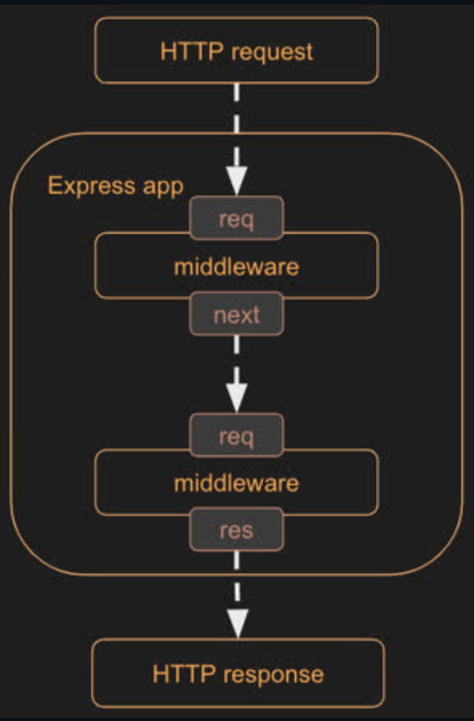

## Node.js

Created by Ryan Dahl

Here's a rough tutorial of how to work with node.js

1. Create a project directory
2. Initialize for NPM use by running `npm init -y` (-y sets to default)
3. Make sure `.gitignore` file contains `node-modules`
4. Install any desired packages with `npm install <package name>`
5. Add `require('package_name')` to code
6. Run with `node index.js`

NVM - Node version manager
Node - JavaScript runtime
NPM - Node package manager

## Express.js

Created by TJ Holowaychuk

Setup:

1. `npm install express`
2. Create an app using express:

```
const express = require('express');
const app = express();

app.listen(8080);
```

3. Use the app object to create middleware functions and add routing

**Routing**

You can use variables in your routing urls. Either use `/store/:storeName'` the :var syntax or add wildcards or Regex's to your urls. Ex:
`app.delete(/\/store\/(.+)/, (req, res) => res.send({delete: req.params[0]}));`

If you don't call next (as shown in the delete example above), then no following middleware functions will be invoked for the request!!!

**Middleware**

Order Matters!

Model of Express apps:


- Express is the mediator, middleware functions are middleware components

## Testing

Playwright

Device Testing

Jest
