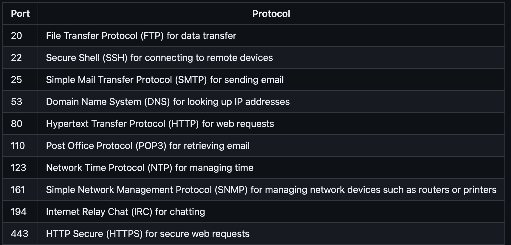
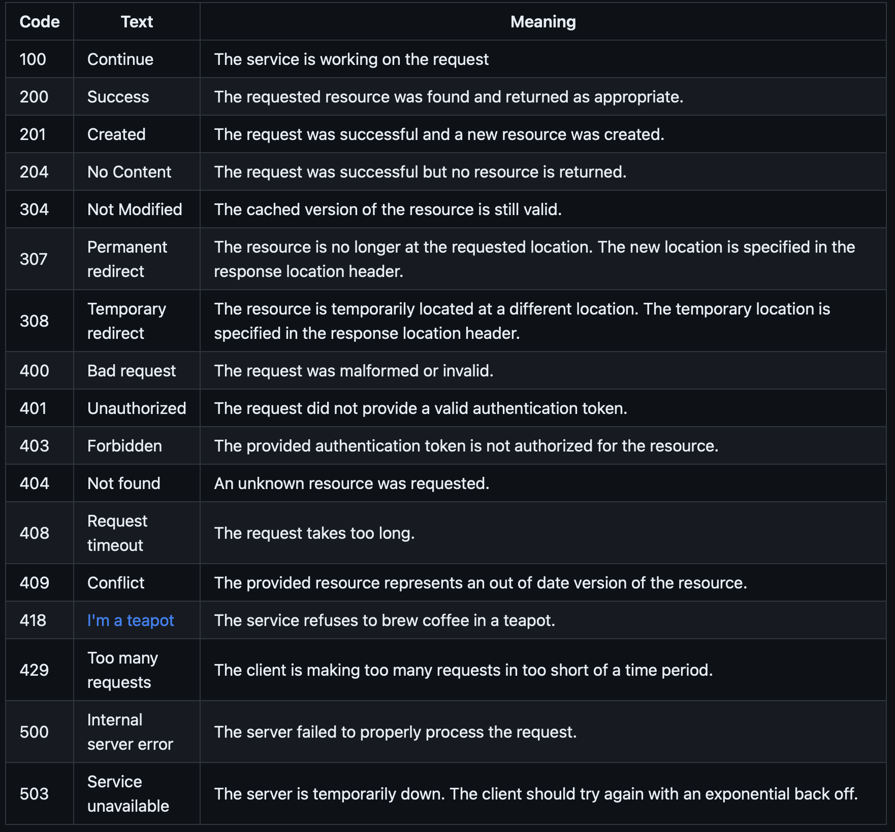
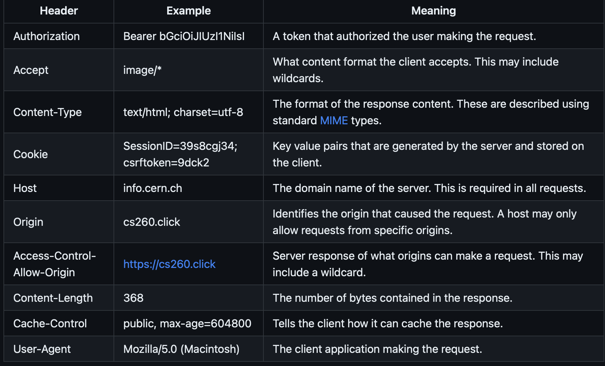

## Web Services

#### Introduction

Files that run on the browser comprise the `frontend` of the application.
Creating a web service with functions to handle `fetch` requests for data storage, user management, security, etc represents the `backend` of the application.

#### URL (Uniform Resource locator)

These specify the location of a web resource (can be a site, database, font, image, etc).
Follows this syntax/convention
`<scheme>://<domain name>:<port>/<path>?<parameters>#<anchor>`

#### Ports

IANA controls them. Lower count are used for more common activities. You need a port and an IP address to connect to any internet service. Here are a few you should know:

Simon and startup run their services on different ports within your web server (because they share the same IP)

#### HTTP

The Protocol used to communicate across the web. Includes requests and responses

**Request**
A request has the following syntax

```
GET /hypertext/WWW/Helping.html HTTP/1.1
Host: info.cern.ch
Accept: text/html
```

OR in other words

```
<verb> <url path, parameters, anchor> <version>
[<header key: value>]*
[

  <body>
]
```

The response has the following syntax:

```
<version> <status code> <status string>
[<header key: value>]*
[

  <body>
]
```

Biggest difference is in the first line

There are several **HTTP verbs** describing the intent of the request. Here are a few common ones

1. GET - request a resource
2. POST - Create a resource (body of request contains resource, response includes unique ID)
3. PUT - Update a resource. You need to specify the unique ID of the resource
4. DELETE - Same as put, but delete it
5. OPTIONS - Get metadata about resource. Resource isn't actually returrned

**Status Codes:**

- 1xx - Informational
- 2xx - Success
- 3xx - Redirect
- 4xx - Client side error
- 5xx - Server side error

Some to know:


**Headers**

Headers specify metadata about a request/response. Include things about security, caching, data formats, and cookies.
Common ones:


**Body**

Defined by the `content-type` header. Can be text/html, image/png, etc

**Cookies**

These are used to track state (HTTP is stateless). A cookie is generated by the server and passed to the client as a header. Client then caches the cookie and returns it as a header in subsequent requests. This enables a site to remember things like language preference or authentication credentials

**Versions**

There have been a bunch. We currently use HTTP2 mostly

**SOP & CORS**

In order to prevent cross-origin requests, browsers made it so you can only run Javascript on the same domain the user is viewing. This is great for security, but can complicate building applications with third-parties. You have to make sure they have either an `*` or your domain explicitly stated in their `access-control-allow-origin:` response header.

#### Fetch

This is an API built into the browser for making HTTP Request. Basic usage takes a url and returns a promise. For example:

```
fetch('https://api.quotable.io/random')
  .then((response) => response.json())
  .then((jsonResponse) => {
    console.log(jsonResponse);
  });
```

With a post request, you would specify the needed parameters and headers in the fetch request, after the URL

#### Web Service Design

Modeling can be a helpful first step
Endpoints are also called API's (Application Programming Interface). Keep the following things in mind as you create endpoints:

1. Grammatical: Act on resources with HTTP verbs (create, get, update)
2. Readable: This is good and memorable: `/store/provo/order/28502`
3. Discoverable: Make top-level endpoints that are easily discoverable -> `GET store/provo`
4. Compatible: Make it so you can add new functionality without breaking existing clients
5. Simple: Endpoints should only do one thing
6. Documented: Use the [Open API Specification](https://spec.openapis.org/oas/latest.html) as a good example of how to document your service endpoints. Making a draft of this document before you begin coding will clarify design and help you achieve a better result

Many models for exposing endpoints. Here are a few common ones: RPC, REST, and GraphQL

**RPC**

Remote Procedure Calls expose service endpoints as simple function calls. The subject is represented by a function call which is passed in the url or POST body.

- Pro: maps directly to function calls
- Con: exposes the inner workings of the service, creates a coupling between endpoint and implementation
- Example:

```
POST /updateOrder HTTP/2

{"id": 2197, "date": "20220505"}
```

**REST**

Representational State Transfer attempts to take advantage of the foundational principles of HTTP. HTTP verbs always act upon a resource (which is uniquely identified in the URL).
By using the proper HTTP verbs, you make it easy for the infrastructure to work properly.
Exmaple:

```
PUT /order/2197 HTTP/2

{"date": "20220505"}
```

GraphQL

Addresses frustrations with the large number of REST or RPC calls that must be made in order to support even simple applications. Instead of parsing your way through endpoints (navigating through store, then employees) you just write a longer query that returns what you need. Pro: You only have one endpoint -> the Query endpoint
Example:

```
query {
  getOrder(id: "2197") {
    orders(filter: {date: {allofterms: "20220505"}}) {
      store
      description
      orderedBy
    }
  }
}
```
